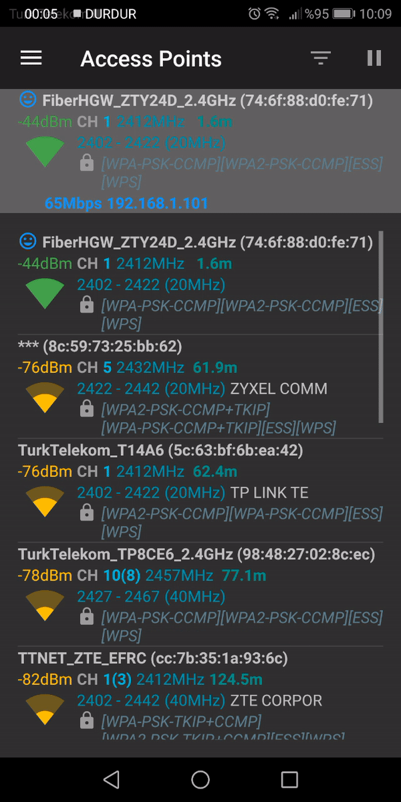

Bu Uygulamanın Amacı Radyo Dalgaları Kullanarak Kullanıcıların Anlık Konumlarının Tespit Edilmesini Amaçlamaktadır.
Aktif Bir GSM Şebekesi Olmasa Bile Mobil Cihazlar Sürekli Baz İstasyonlarına İstek Göndermektedir.
Halka Açık Kullanım Alanlarında Konum Takibi ve Kişi Sayısı Tespitinde Kullanılacaktır.
Temel Çalışma Algortitması Wifi Üçgenleme Metoduna Dayanır Bknz ;

   

Sistem Bu Denklemde Bulunan Değikenleri Radyo Frekans Dalgaları Kullanarak İlgili Değerleri Alır. Sistem Ağ Sağlayacıları Yada Ağda Bulunan Cihazları Bu Şekilde Sıralar ;

    

   Daha sonrasında sistemin arayüz iyileştirmelerini yapmayı planladık ve bazı tasarımlar üzerinde yoğunlaştık ; 

   

   Bknz ; 

   

   Bknz ; 

   

   

   

   
